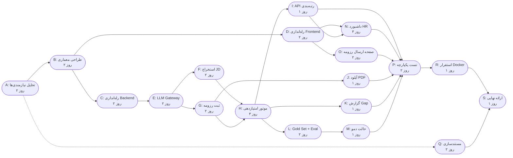
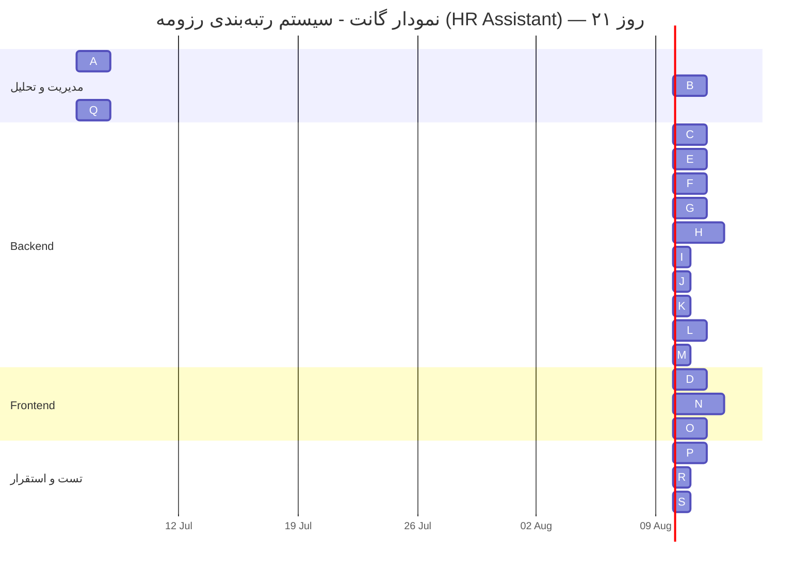

# سند مدیریت پروژه — سیستم رتبه‌بندی رزومه با هوش مصنوعی (HR Assistant)

---

## فهرست مطالب

1. [موضوع پروژه، سناریو، اهداف، جامعه هدف](#1)
2. [محدوده پروژه (Scope)](#2)
3. [ساختار شکست کار (WBS)](#3)
4. [بسته‌های کاری (Work Packages)](#4)
5. [تخمین زمان](#5)
6. [تخمین هزینه](#6)
7. [نمودار شبکه فعالیت‌ها](#7)
8. [مسیر بحرانی](#8)
9. [نمودار گانت](#9)
10. [مدیریت ارزش کسب شده (EVM)](#10)
11. [برنامه‌ریزی Trello](#11)
12. [نمودار گانت در MS Project](#12)

---

## <a name="1"></a>۱. موضوع پروژه، سناریو، اهداف، جامعه هدف

### ۱.۱ عنوان پروژه

**سیستم رتبه‌بندی هوشمند رزومه به زبان فارسی (HR Assistant)**

### ۱.۲ سناریوی پروژه

یک شرکت فناوری‌محور در حال استخدام برای یک موقعیت شغلی، ده‌ها رزومه دریافت می‌کند. کارشناس منابع انسانی (HR) مجبور است هر رزومه را به صورت دستی بخواند و حدس بزند کدام کاندید بهترین تطابق را با شرح شغل دارد. این فرایند کند، ناسازگار و غیرقابل توجیه است — به ویژه وقتی رزومه‌ها با سبک‌های مختلف نوشته شده‌اند و مهارت‌ها گاهی به فارسی و گاهی به انگلیسی ذکر می‌شوند (مثلاً "React" در کنار "ری‌اکت").

پروژه حاضر یک اپلیکیشن وب فارسی راست‌به‌چپ طراحی می‌کند که:
- کارشناس HR شرح شغل را ثبت می‌کند
- هوش مصنوعی به صورت خودکار مهارت‌های مورد نیاز، سابقه کار، مدرک تحصیلی و سطح ارشدیت را استخراج می‌کند
- متقاضیان رزومه خود را ارسال می‌کنند (به صورت متن یا آپلود PDF)
- سیستم هر رزومه را در برابر شرح شغل امتیازدهی می‌کند
- رزومه‌ها به ترتیب بهترین تطابق رتبه‌بندی و نمایش داده می‌شوند

### ۱.۳ اهداف پروژه

| هدف | شرح |
|------|-------|
| **هدف کلی** | طراحی و پیاده‌سازی سامانه هوشمند رتبه‌بندی رزومه به زبان فارسی |
| **هدف اختصاصی ۱** | استخراج خودکار نیازمندی‌های شغلی از شرح شغل با استفاده از LLM |
| **هدف اختصاصی ۲** | دریافت رزومه متقاضیان (متن و PDF) و استخراج فیلدهای ساختاریافته |
| **هدف اختصاصی ۳** | امتیازدهی قطعی و شفاف به هر رزومه بر اساس تطابق با شرح شغل |
| **هدف اختصاصی ۴** | رتبه‌بندی رزومه‌ها به ترتیب بهترین تطابق با قابلیت توضیح‌دهی |
| **هدف اختصاصی ۵** | ارائه گزارش Gap به متقاضی (مهارت‌های缺失) |
| **هدف اختصاصی ۶** | ارزیابی کیفیت رتبه‌بندی با معیارهای Precision@3 و nDCG |
| **هدف اختصاصی ۷** | قابلیت اجرای دمو با داده‌های از پیش محاسبه‌شده (بدون نیاز به API زنده) |

### ۱.۴ جامعه هدف

| ذی‌نفع | نقش | نیاز |
|--------|------|------|
| **کارشناس منابع انسانی (HR)** | کاربر اصلی سمت مدیریت | مشاهده رتبه‌بندی کاندیداها، بررسی جزئیات امتیاز، ویرایش نیازمندی‌ها |
| **متقاضی (Applicant)** | کاربر سمت متقاضی | ارسال رزومه، مشاهده گزارش Gap |
| **مدیر فناوری اطلاعات** | کارفرمای پروژه | استقرار سیستم، اطمینان از کیفیت |
| **توسعه‌دهندگان** | مجریان پروژه | نگهداری و توسعه سیستم |

---

## <a name="2"></a>۲. محدوده پروژه (Scope)

### ۲.۱ در محدوده (In-Scope)

- ثبت و مدیریت شرح شغل (Job Description) توسط HR
- استخراج خودکار نیازمندی‌های شغلی از متن شرح شغل via LLM
- نمایش، بررسی و ویرایش نیازمندی‌های استخراج‌شده توسط HR
- ارسال رزومه توسط متقاضی (به صورت چسباندن متن یا آپلود PDF)
- استخراج فیلدهای رزومه (مهارت‌ها، سابقه کار، تحصیلات) via LLM
- قضاوت per-skill (yes/partial/no) برای هر مهارت مورد نیاز
- امتیازدهی قطعی وزن‌دار (Match Score 0-1)
- رتبه‌بندی کاندیداها برای هر شرح شغل
- نمایش breakdown امتیاز برای شفافیت
- گزارش Gap فقط‌خواندنی برای متقاضی
- Gold Set ارزیابی با Precision@3 و nDCG
- حالت دمو با داده‌های از پیش محاسبه‌شده
- قابلیت اجرای "رتبه‌بندی زنده" (Rank Now)
- پشتیبانی کامل از زبان فارسی و راست‌به‌چپ
- تطبیق مهارت‌های فارسی/انگلیسی
- نرمال‌سازی ارقام فارسی/عربی

### ۲.۲ خارج از محدوده (Out-of-Scope)

- احراز هویت و حساب کاربری
- چت یا تعامل هوش مصنوعی با متقاضی
- بازنویسی رزومه توسط هوش مصنوعی
- پردازش دسته‌ای فایل‌ها (Batch Processing)
- صف‌های پردازش ناهمگام (Async Job Queues)
- استخراج دقیق layout PDF (فقط متن ساده)
- بازخورد گزارش Gap به رتبه‌بندی
- استقرار در فضای ابری (فقط اجرای محلی)
- اپلیکیشن موبایل

### ۲.۳ ماتریس ردیابی محدوده به WBS (Scope-to-WBS Traceability)

| # | آیتم محدوده (Scope Item) | نوع | کد WBS مرتبط |
|---|--------------------------|-----|-------------|
| S1 | ثبت و مدیریت شرح شغل توسط HR | In-Scope | ۱.۳.۱, ۱.۴.۲ |
| S2 | استخراج خودکار نیازمندی‌های شغلی via LLM | In-Scope | ۱.۳.۲, ۱.۳.۳ |
| S3 | نمایش، بررسی و ویرایش نیازمندی‌ها توسط HR | In-Scope | ۱.۳.۳, ۱.۴.۲ |
| S4 | ارسال رزومه توسط متقاضی (متن یا PDF) | In-Scope | ۱.۳.۴, ۱.۳.۷, ۱.۴.۳ |
| S5 | استخراج فیلدهای رزومه via LLM | In-Scope | ۱.۳.۲, ۱.۳.۴ |
| S6 | قضاوت per-skill (yes/partial/no) | In-Scope | ۱.۳.۵ |
| S7 | امتیازدهی قطعی وزن‌دار (Match Score 0-1) | In-Scope | ۱.۳.۵ |
| S8 | رتبه‌بندی کاندیداها برای هر شرح شغل | In-Scope | ۱.۳.۶ |
| S9 | نمایش breakdown امتیاز برای شفافیت | In-Scope | ۱.۳.۶, ۱.۴.۲ |
| S10 | گزارش Gap فقط‌خواندنی برای متقاضی | In-Scope | ۱.۳.۸, ۱.۴.۴ |
| S11 | Gold Set ارزیابی با Precision@3 و nDCG | In-Scope | ۱.۳.۱۰, ۱.۵.۵ |
| S12 | حالت دمو با داده‌های از پیش محاسبه‌شده | In-Scope | ۱.۳.۹, ۱.۷.۲ |
| S13 | قابلیت اجرای "رتبه‌بندی زنده" (Rank Now) | In-Scope | ۱.۳.۹ |
| S14 | پشتیبانی کامل از فارسی و راست‌به‌چپ | In-Scope | ۱.۴.۱ |
| S15 | تطبیق مهارت‌های فارسی/انگلیسی | In-Scope | ۱.۳.۲, ۱.۳.۵ |
| S16 | نرمال‌سازی ارقام فارسی/عربی | In-Scope | ۱.۳.۳, ۱.۳.۴ |
| S17 | احراز هویت و حساب کاربری | Out-of-Scope | — |
| S18 | استقرار در فضای ابری | Out-of-Scope | — |

---

## <a name="3"></a>۳. ساختار شکست کار (WBS)

```
1. سیستم رتبه‌بندی رزومه (HR Assistant)
│
├── 1.1 مدیریت پروژه
│   ├── 1.1.1 برنامه‌ریزی و زمان‌بندی پروژه
│   ├── 1.1.2 جلسات هماهنگی تیمی
│   └── 1.1.3 گزارش‌دهی پیشرفت
│
├── 1.2 تحلیل و طراحی
│   ├── 1.2.1 تحلیل نیازمندی‌ها
│   ├── 1.2.2 طراحی معماری سیستم
│   ├── 1.2.3 طراحی پایگاه داده
│   └── 1.2.4 طراحی UI/UX
│
├── 1.3 پیاده‌سازی Backend
│   ├── 1.3.1 راه‌اندازی پروژه FastAPI + SQLite
│   ├── 1.3.2 پیاده‌سازی لایه دروازه LLM (Gateway)
│   ├── 1.3.3 پیاده‌سازی استخراج نیازمندی‌های شغلی (JD Extraction)
│   ├── 1.3.4 پیاده‌سازی ثبت رزومه (Submission)
│   ├── 1.3.5 پیاده‌سازی موتور امتیازدهی (Scorer)
│   ├── 1.3.6 پیاده‌سازی API رتبه‌بندی و Ranking
│   ├── 1.3.7 پیاده‌سازی آپلود PDF رزومه
│   ├── 1.3.8 پیاده‌سازی گزارش Gap
│   ├── 1.3.9 پیاده‌سازی حالت دمو (Seed Data + Rank Now)
│   └── 1.3.10 پیاده‌سازی Evaluation Harness
│
├── 1.4 پیاده‌سازی Frontend
│   ├── 1.4.1 راه‌اندازی Next.js + RTL + Vazirmatn
│   ├── 1.4.2 پیاده‌سازی داشبورد مدیریت HR
│   ├── 1.4.3 پیاده‌سازی صفحه ارسال رزومه
│   └── 1.4.4 پیاده‌سازی گزارش Gap در فرانت‌اند
│
├── 1.5 تست و تضمین کیفیت
│   ├── 1.5.1 تست‌های واحد (Unit Tests)
│   ├── 1.5.2 تست‌های API (Integration Tests)
│   ├── 1.5.3 تست دروازه LLM (Seam 1)
│   ├── 1.5.4 تست امتیازدهی (Seam 2)
│   └── 1.5.5 اجرای ارزیابی Gold Set
│
├── 1.6 استقرار و مستندسازی
│   ├── 1.6.1 راه‌اندازی Docker Compose
│   ├── 1.6.2 مستندسازی فنی (README, ADR, معماری)
│   ├── 1.6.3 مستندسازی کاربری
│   └── 1.6.4 ارائه نهایی
│
└── 1.7 آماده‌سازی داده
    ├── 1.7.1 طراحی Gold Set (شرح شغل + ۱۰ رزومه برچسب‌گذاری شده)
    └── 1.7.2 آماده‌سازی داده‌های دمو
```

---

## <a name="4"></a>۴. بسته‌های کاری (Work Packages)

### ۴.۱ نگاشت WBS به GitHub Issues

| کد WP | نام بسته کاری | تحویلی‌ها (Deliverables) | تخصیص | GitHub Issue |
|-------|---------------|---------------------------|--------|-------------|
| WP1.1 | برنامه‌ریزی پروژه | برنامه زمان‌بندی، WBS، تخمین‌ها | مدیر پروژه | — |
| WP1.2 | تحلیل نیازمندی‌ها | مستند PRD، user stories | تحلیلگر | [#1](https://github.com/ErfanMowlavian/HR-Assistant/issues/1) |
| WP1.3 | طراحی معماری | نمودار معماری، ADRها، مدل دامنه | معمار | — |
| WP1.4 | راه‌اندازی Backend | پروژه FastAPI، مدل‌های SQLite، اسکلت API | توسعه‌دهنده ۱ | [#2](https://github.com/ErfanMowlavian/HR-Assistant/issues/2) |
| WP1.5 | دروازه LLM | اینترفیس Gateway، FakeLLM، LiteLLM | توسعه‌دهنده ۱ | ذیل #۲ |
| WP1.6 | استخراج JD | ماژول extraction، API نیازمندی‌ها | توسعه‌دهنده ۱ | [#3](https://github.com/ErfanMowlavian/HR-Assistant/issues/3) |
| WP1.7 | ثبت رزومه | ماژول submission، آپلود PDF | توسعه‌دهنده ۱ | [#4](https://github.com/ErfanMowlavian/HR-Assistant/issues/4) |
| WP1.8 | موتور امتیازدهی | Scorer، Judging، رتبه‌بندی | توسعه‌دهنده ۱ | [#5](https://github.com/ErfanMowlavian/HR-Assistant/issues/5) |
| WP1.9 | راه‌اندازی Frontend | Next.js، shadcn/ui، قالب RTL | توسعه‌دهنده ۲ | [#2](https://github.com/ErfanMowlavian/HR-Assistant/issues/2) |
| WP1.10 | داشبورد HR | فرم ایجاد شغل، لیست، رتبه‌بندی | توسعه‌دهنده ۲ | [#5](https://github.com/ErfanMowlavian/HR-Assistant/issues/5) |
| WP1.11 | صفحه متقاضی | فرم ارسال، گزارش Gap | توسعه‌دهنده ۲ | [#4](https://github.com/ErfanMowlavian/HR-Assistant/issues/4), [#9](https://github.com/ErfanMowlavian/HR-Assistant/issues/9) |
| WP1.12 | ارزیابی | Gold Set، Precision@3، nDCG | تیم (مشترک) | [#6](https://github.com/ErfanMowlavian/HR-Assistant/issues/6) |
| WP1.13 | حالت دمو | دیتاهای Seed، دکمه Rank Now | توسعه‌دهنده ۱ | [#7](https://github.com/ErfanMowlavian/HR-Assistant/issues/7) |
| WP1.14 | آپلود PDF | استخراج متن PDF + تشخیص فارسی خراب | توسعه‌دهنده ۱ | [#8](https://github.com/ErfanMowlavian/HR-Assistant/issues/8) |
| WP1.15 | Docker | docker-compose.yml، Dockerfileها | تیم (مشترک) | — |
| WP1.16 | Refactoring | یکپارچه‌سازی Judging، Gateway تایپ‌شده، Normalize | توسعه‌دهنده ۱ | [#10](https://github.com/ErfanMowlavian/HR-Assistant/issues/10)–[#14](https://github.com/ErfanMowlavian/HR-Assistant/issues/14) |
| WP1.17 | رفع باگ‌های همزمانی | WAL + Async Scoring | توسعه‌دهنده ۱ | [#15](https://github.com/ErfanMowlavian/HR-Assistant/issues/15), [#16](https://github.com/ErfanMowlavian/HR-Assistant/issues/16), [#17](https://github.com/ErfanMowlavian/HR-Assistant/issues/17) |
| WP1.18 | تست | تست‌های واحد، یکپارچه، ارزیابی | تیم (مشترک) | تمام Issues |
| WP1.19 | مستندسازی | README، ADR، واژه‌نامه، گزارش | تیم (مشترک) | — |

### ۴.۲ تفکیک Issues بر اساس هفته

| هفته | شماره Issues | شرح |
|------|-------------|------|
| هفته ۱ | [#1](https://github.com/ErfanMowlavian/HR-Assistant/issues/1), [#2](https://github.com/ErfanMowlavian/HR-Assistant/issues/2) | PRD + Walking Skeleton |
| هفته ۲ | [#3](https://github.com/ErfanMowlavian/HR-Assistant/issues/3), [#4](https://github.com/ErfanMowlavian/HR-Assistant/issues/4) | استخراج JD + ثبت رزومه |
| هفته ۳ | [#5](https://github.com/ErfanMowlavian/HR-Assistant/issues/5), [#6](https://github.com/ErfanMowlavian/HR-Assistant/issues/6), [#7](https://github.com/ErfanMowlavian/HR-Assistant/issues/7), [#8](https://github.com/ErfanMowlavian/HR-Assistant/issues/8), [#9](https://github.com/ErfanMowlavian/HR-Assistant/issues/9) | امتیازدهی، ارزیابی، دمو، PDF، Gap |
| هفته ۴ | [#10](https://github.com/ErfanMowlavian/HR-Assistant/issues/10)–[#17](https://github.com/ErfanMowlavian/HR-Assistant/issues/17) | Refactoring، رفع باگ، تکمیل |

### ۴.۳ فرهنگ WBS (WBS Dictionary)

| کد WBS | نام بسته | شرح | تحویلی‌ها (Deliverables) | معیار پذیرش |
|--------|---------|------|------------------------|------------|
| ۱.۱ | مدیریت پروژه | برنامه‌ریزی، هماهنگی و گزارش‌دهی پروژه | برنامه زمان‌بندی، صورتجلسات، گزارش پیشرفت | تأیید ذی‌نفعان |
| ۱.۲ | تحلیل و طراحی | تحلیل نیازمندی‌ها و طراحی معماری سیستم | PRD، ADRها، نمودار معماری، مدل دامنه، UI Mockup | بازبینی تیمی |
| ۱.۳.۱ | راه‌اندازی Backend | پروژه FastAPI + SQLite + Models | کد پروژه، مدل‌های ORM، اسکلت API | pytest موفق |
| ۱.۳.۲ | لایه دروازه LLM | اینترفیس Gateway + Fake + LiteLLM | اینترفیس، ۲ پیاده‌سازی، خطاهای تایپ‌شده | تست‌های Gateway |
| ۱.۳.۳ | استخراج JD | استخراج نیازمندی‌های شغلی | سرویس extraction، API نیازمندی‌ها | تست استخراج |
| ۱.۳.۴ | ثبت رزومه | دریافت و استخراج رزومه | سرویس submission، API ارسال | تست ثبت رزومه |
| ۱.۳.۵ | موتور امتیازدهی | Scorer + Judging قطعی | تابع scorer، قضاوت per-skill | تست‌های scorer |
| ۱.۳.۶ | API رتبه‌بندی | Ranking endpoints | GET ranking، POST rank-now | تست رتبه‌بندی |
| ۱.۳.۷ | آپلود PDF | استخراج متن PDF + هیوریستیک | ماژول PDF، API آپلود | تست PDF تمیز/خراب |
| ۱.۳.۸ | گزارش Gap | Gap report برای متقاضی | API گزارش Gap فقط‌خواندنی | تست Gap |
| ۱.۳.۹ | حالت دمو | Seed data + Rank Now | اسکریپت seed، دکمه rank-now | تست seed |
| ۱.۳.۱۰ | Evaluation | Gold Set + Harness + Metrics | Gold Set، harness، Precision@3/nDCG | تست ارزیابی |
| ۱.۴.۱ | راه‌اندازی Frontend | Next.js + shadcn/ui + RTL | پروژه Next.js، قالب RTL، فونت | build موفق |
| ۱.۴.۲ | داشبورد مدیریت HR | فرم ایجاد شغل، لیست، رتبه‌بندی | کامپوننت‌های dashboard | تست فرانت‌اند |
| ۱.۴.۳ | صفحه ارسال رزومه | فرم paste + آپلود برای متقاضی | کامپوننت‌های applicant | تست فرانت‌اند |
| ۱.۵ | تست و تضمین کیفیت | تست‌های واحد، یکپارچه، ارزیابی | ~۲۵ فایل تست | پوشش > ۹۰٪ |
| ۱.۶ | استقرار و مستندسازی | Docker + مستندات | docker-compose، README، ADRها، واژه‌نامه | داکر آپ success |

### ۴.۴ ماتریس مسئولیت‌پذیری (RAM — Responsibility Assignment Matrix)

| کد WBS | نام بسته | Dev1 (Backend) | Dev2 (Frontend) | تحلیلگر/مدیر |
|--------|---------|:---:|:---:|:---:|
| ۱.۱ | مدیریت پروژه | I | I | **R/A** |
| ۱.۲ | تحلیل و طراحی | **A** | **A** | **R** |
| ۱.۳.۱ | راه‌اندازی Backend | **R/A** | I | C |
| ۱.۳.۲ | لایه دروازه LLM | **R/A** | — | C |
| ۱.۳.۳ | استخراج JD | **R/A** | — | C |
| ۱.۳.۴ | ثبت رزومه | **R/A** | I | C |
| ۱.۳.۵ | موتور امتیازدهی | **R/A** | — | C |
| ۱.۳.۶ | API رتبه‌بندی | **R/A** | I | C |
| ۱.۳.۷ | آپلود PDF | **R/A** | — | C |
| ۱.۳.۸ | گزارش Gap | **R/A** | C | C |
| ۱.۳.۹ | حالت دمو | **R/A** | C | C |
| ۱.۳.۱۰ | Evaluation | **R/A** | — | C |
| ۱.۴.۱ | راه‌اندازی Frontend | I | **R/A** | C |
| ۱.۴.۲ | داشبورد مدیریت HR | C | **R/A** | C |
| ۱.۴.۳ | صفحه ارسال رزومه | I | **R/A** | C |
| ۱.۵ | تست و تضمین کیفیت | **A** | **A** | **R** |
| ۱.۶ | استقرار و مستندسازی | **A** | **A** | **R** |

> **R** = مسئول (Responsible) | **A** = پاسخگو (Accountable) | **C** = مشورت‌شونده (Consulted) | **I** = مطلع‌شونده (Informed)

---

## <a name="5"></a>۵. تخمین زمان

مدت پروژه: **۴ هفته + ۱ روز (۲۱ روز کاری)** — تیم ۲ نفره

### ۵.۱ فعالیت‌ها و پیش‌نیازها

| کد | نام فعالیت | مدت (روز) | پیش‌نیاز | منبع |
|----|-----------|-----------|----------|------|
| A | تحلیل نیازمندی‌ها | ۲ | — | هردو |
| B | طراحی معماری و پایگاه داده | ۲ | A | هردو |
| C | راه‌اندازی Backend (FastAPI + SQLite) | ۲ | B | Dev1 |
| D | راه‌اندازی Frontend (Next.js + RTL) | ۲ | B | Dev2 |
| E | پیاده‌سازی LLM Gateway | ۲ | C | Dev1 |
| F | استخراج نیازمندی‌های JD | ۲ | E | Dev1 |
| G | ثبت رزومه (Submission + API) | ۲ | E | Dev1 |
| H | موتور امتیازدهی (Scorer + Judging) | ۳ | F, G | Dev1 |
| I | API رتبه‌بندی (Ranking) | ۱ | H | Dev1 |
| J | آپلود PDF رزومه | ۱ | G | Dev1 |
| K | گزارش Gap (Backend) | ۱ | H | Dev1 |
| L | Gold Set + Evaluation Harness | ۲ | H | Dev1 |
| M | حالت دمو (Seed + Rank Now) | ۱ | L | Dev1 |
| N | داشبورد مدیریت HR (Frontend) | ۳ | D, I | Dev2 |
| O | صفحه ارسال رزومه (Frontend) | ۲ | D | Dev2 |
| P | تست‌های یکپارچه | ۲ | I, N, O, J, K, M | هردو |
| Q | مستندسازی | ۲ | A (شروع موازی) | هردو |
| R | استقرار Docker | ۱ | P | هردو |
| S | ارائه نهایی | ۱ | Q, R | هردو |

### ۵.۲ تخصیص منابع

| منبع | نقش | تخصص |
|------|------|------|
| **توسعه‌دهنده ۱ (Dev1)** | توسعه‌دهنده Backend | FastAPI, Python, SQLite, LLM |
| **توسعه‌دهنده ۲ (Dev2)** | توسعه‌دهنده Frontend | Next.js, React, shadcn/ui, RTL |
| **هردو (Both)** | تحلیل، طراحی، تست، استقرار | — |

---

## <a name="6"></a>۶. تخمین هزینه

پروژه به صورت **آموزشی** و با **تیم ۲ نفره** اجرا می‌شود و هزینه‌های واقعی ناچیز است. بر اساس نرخ‌های متعارف، تخمین به صورت زیر است:

### ۶.۱ هزینه نیروی انسانی

| نقش | نرخ روزانه (تومان) | روز-فرد | هزینه (تومان) |
|-----|-------------------|---------|--------------|
| توسعه‌دهنده Backend | ۵۰۰٬۰۰۰ | ۱۸ | ۹٬۰۰۰٬۰۰۰ |
| توسعه‌دهنده Frontend | ۵۰۰٬۰۰۰ | ۱۳ | ۶٬۵۰۰٬۰۰۰ |
| تحلیلگر/مدیر پروژه | ۴۰۰٬۰۰۰ | ۶ | ۲٬۴۰۰٬۰۰۰ |
| **جمع نیروی انسانی** | | **۳۷** | **۱۷٬۹۰۰٬۰۰۰** |

### ۶.۲ هزینه زیرساخت (دوره ۱ ماهه)

| آیتم | هزینه (تومان) |
|------|--------------|
| اینترنت و برق | ۳۰۰٬۰۰۰ |
| GitHub (رایگان) | ۰ |
| Docker (رایگان) | ۰ |
| LLM API (حالت دمو بدون API) | ۰ |
| **جمع زیرساخت** | **۳۰۰٬۰۰۰** |

### ۶.۳ جمع کل

| بخش | هزینه (تومان) |
|-----|--------------|
| هزینه نیروی انسانی | ۱۷٬۹۰۰٬۰۰۰ |
| هزینه زیرساخت | ۳۰۰٬۰۰۰ |
| **جمع کل پروژه** | **۱۸٬۲۰۰٬۰۰۰** |

> نکته: در سناریوی آموزشی، تیم دانشجویی است و هزینه نیروی انسانی به صورت فرضی محاسبه شده است. هزینه واقعی پروژه نزدیک به صفر است.

---

## <a name="7"></a>۷. نمودار شبکه فعالیت‌ها

نمودار شبکه فعالیت‌ها با روش Activity-on-Node (AON):



### ۷.۱ جدول پیش‌نیازی (Precedence Table)

| فعالیت | شرح | مدت | پیش‌نیاز | پس‌نیاز |
|--------|-----|------|----------|----------|
| A | تحلیل نیازمندی‌ها | ۲ | — | B, Q |
| B | طراحی معماری | ۲ | A | C, D |
| C | راه‌اندازی Backend | ۲ | B | E |
| D | راه‌اندازی Frontend | ۲ | B | N, O |
| E | LLM Gateway | ۲ | C | F, G |
| F | استخراج JD | ۲ | E | H |
| G | ثبت رزومه | ۲ | E | H, J |
| H | موتور امتیازدهی | ۳ | F, G | I, K, L |
| I | API رتبه‌بندی | ۱ | H | N, P |
| J | آپلود PDF | ۱ | G | P |
| K | گزارش Gap | ۱ | H | P |
| L | Gold Set + Eval | ۲ | H | M |
| M | حالت دمو | ۱ | L | P |
| N | داشبورد HR | ۳ | D, I | P |
| O | صفحه ارسال رزومه | ۲ | D | P |
| P | تست یکپارچه | ۲ | I, N, O, J, K, M | R |
| Q | مستندسازی | ۲ | A | S |
| R | استقرار Docker | ۱ | P | S |
| S | ارائه نهایی | ۱ | Q, R | — |

### ۷.۲ محاسبات Forward Pass و Backward Pass

#### روش محاسبه Forward Pass (محاسبه پیشرو)

فرمول‌ها:
- **ES (Early Start)** = max(EF تمام پیش‌نیازها) — برای فعالیت‌های شروع: ES = ۰
- **EF (Early Finish)** = ES + مدت فعالیت

محاسبه گام‌به‌گام:

| گام | فعالیت | محاسبه ES | ES | مدت | EF |
|-----|--------|-----------|:--:|:---:|:--:|
| ۱ | A | ES=0 (شروع) | ۰ | ۲ | ۲ |
| ۲ | B | ES=EF_A=2 | ۲ | ۲ | ۴ |
| ۳ | C | ES=EF_B=4 | ۴ | ۲ | ۶ |
| ۴ | D | ES=EF_B=4 | ۴ | ۲ | ۶ |
| ۵ | E | ES=EF_C=6 | ۶ | ۲ | ۸ |
| ۶ | F | ES=EF_E=8 | ۸ | ۲ | ۱۰ |
| ۷ | G | ES=EF_E=8 | ۸ | ۲ | ۱۰ |
| ۸ | H | ES=max(EF_F=10, EF_G=10) | ۱۰ | ۳ | ۱۳ |
| ۹ | I | ES=EF_H=13 | ۱۳ | ۱ | ۱۴ |
| ۱۰ | J | ES=EF_G=10 | ۱۰ | ۱ | ۱۱ |
| ۱۱ | K | ES=EF_H=13 | ۱۳ | ۱ | ۱۴ |
| ۱۲ | L | ES=EF_H=13 | ۱۳ | ۲ | ۱۵ |
| ۱۳ | M | ES=EF_L=15 | ۱۵ | ۱ | ۱۶ |
| ۱۴ | N | ES=max(EF_D=6, EF_I=14) → ۱۴ | ۱۴ | ۳ | ۱۷ |
| ۱۵ | O | ES=EF_D=6 | ۶ | ۲ | ۸ |
| ۱۶ | Q | ES=EF_A=2 (شروع موازی) | ۲ | ۲ | ۴ |
| ۱۷ | P | ES=max(EF_I=14, EF_N=17, EF_O=8, EF_J=11, EF_K=14, EF_M=16) | ۱۷ | ۲ | ۱۹ |
| ۱۸ | R | ES=EF_P=19 | ۱۹ | ۱ | ۲۰ |
| ۱۹ | S | ES=max(EF_Q=4, EF_R=20) | ۲۰ | ۱ | ۲۱ |

> **نکته مهم:** در محاسبه ES فعالیت P، مشخص شد که EF_N (داشبورد HR) = ۱۷ بالاترین مقدار است، بنابراین ES_P = ۱۷.

#### روش محاسبه Backward Pass (محاسبه پسرو)

فرمول‌ها:
- **LF (Late Finish)** = min(LS تمام پس‌نیازها) — برای فعالیت‌های پایانی: LF = پروژه مدت
- **LS (Late Start)** = LF - مدت فعالیت
- **Slack (Float)** = LS - ES (یا LF - EF)

محاسبه گام‌به‌گام:

| گام | فعالیت | محاسبه LF | LF | مدت | LS | Slack |
|-----|--------|-----------|:--:|:---:|:--:|:----:|
| ۱ | S | LF=21 (پایان پروژه) | ۲۱ | ۱ | ۲۰ | **۰** |
| ۲ | R | LS_S=20 | ۲۰ | ۱ | ۱۹ | **۰** |
| ۳ | P | LS_R=19 | ۱۹ | ۲ | ۱۷ | **۰** |
| ۴ | Q | LS_S=20 | ۲۰ | ۲ | ۱۸ | ۱۶ |
| ۵ | N | LS_P=17 | ۱۷ | ۳ | ۱۴ | **۰** |
| ۶ | I | min(LS_P=17, LS_N=14) → ۱۴ | ۱۴ | ۱ | ۱۳ | **۰** |
| ۷ | M | LS_P=17 | ۱۷ | ۱ | ۱۶ | ۱ |
| ۸ | L | LS_M=16 | ۱۶ | ۲ | ۱۴ | ۱ |
| ۹ | K | LS_P=17 | ۱۷ | ۱ | ۱۶ | ۳ |
| ۱۰ | J | LS_P=17 | ۱۷ | ۱ | ۱۶ | ۶ |
| ۱۱ | H | min(LS_I=13, LS_K=16, LS_L=14) → ۱۳ | ۱۳ | ۳ | ۱۰ | **۰** |
| ۱۲ | F | LS_H=10 | ۱۰ | ۲ | ۸ | **۰** |
| ۱۳ | G | min(LS_H=10, LS_J=16) → ۱۰ | ۱۰ | ۲ | ۸ | **۰** |
| ۱۴ | E | min(LS_F=8, LS_G=8) → ۸ | ۸ | ۲ | ۶ | **۰** |
| ۱۵ | C | LS_E=6 | ۶ | ۲ | ۴ | **۰** |
| ۱۶ | D | min(LS_N=14, LS_O=17) → ۱۴ | ۱۴ | ۲ | ۱۲ | ۸ |
| ۱۷ | O | LS_P=17 → پس‌نیاز | ۱۷ | ۲ | ۱۵ | ۱۱ |
| ۱۸ | B | min(LS_C=4, LS_D=12) → ۴ | ۴ | ۲ | ۲ | **۰** |
| ۱۹ | A | min(LS_B=2, LS_Q=18) → ۲ | ۲ | ۲ | ۰ | **۰** |

#### جمع‌بندی Forward/Backward Pass

| فعالیت | مدت | ES | EF | LS | LF | Slack | مسیر بحرانی؟ |
|--------|:---:|:--:|:--:|:--:|:--:|:----:|:-----------:|
| A | ۲ | ۰ | ۲ | ۰ | ۲ | ۰ | ✅ |
| B | ۲ | ۲ | ۴ | ۲ | ۴ | ۰ | ✅ |
| C | ۲ | ۴ | ۶ | ۴ | ۶ | ۰ | ✅ |
| D | ۲ | ۴ | ۶ | ۱۲ | ۱۴ | ۸ | ❌ |
| E | ۲ | ۶ | ۸ | ۶ | ۸ | ۰ | ✅ |
| F | ۲ | ۸ | ۱۰ | ۸ | ۱۰ | ۰ | ✅ |
| G | ۲ | ۸ | ۱۰ | ۸ | ۱۰ | ۰ | ✅ |
| H | ۳ | ۱۰ | ۱۳ | ۱۰ | ۱۳ | ۰ | ✅ |
| I | ۱ | ۱۳ | ۱۴ | ۱۳ | ۱۴ | ۰ | ✅ |
| J | ۱ | ۱۰ | ۱۱ | ۱۶ | ۱۷ | ۶ | ❌ |
| K | ۱ | ۱۳ | ۱۴ | ۱۶ | ۱۷ | ۳ | ❌ |
| L | ۲ | ۱۳ | ۱۵ | ۱۴ | ۱۶ | ۱ | ❌ |
| M | ۱ | ۱۵ | ۱۶ | ۱۶ | ۱۷ | ۱ | ❌ |
| N | ۳ | ۱۴ | ۱۷ | ۱۴ | ۱۷ | ۰ | ✅ |
| O | ۲ | ۶ | ۸ | ۱۵ | ۱۷ | ۱۱ | ❌ |
| P | ۲ | ۱۷ | ۱۹ | ۱۷ | ۱۹ | ۰ | ✅ |
| Q | ۲ | ۲ | ۴ | ۱۸ | ۲۰ | ۱۶ | ❌ |
| R | ۱ | ۱۹ | ۲۰ | ۱۹ | ۲۰ | ۰ | ✅ |
| S | ۱ | ۲۰ | ۲۱ | ۲۰ | ۲۱ | ۰ | ✅ |

> توجه: با محاسبه دقیق، فعالیت N (داشبورد HR) نیز در مسیر بحرانی قرار دارد چون ES آن به EF_I وابسته است. مدت واقعی پروژه ۲۱ روز است (نه ۱۸ روز).

---

## <a name="8"></a>۸. مسیر بحرانی (Critical Path)

### ۸.۱ محاسبه مسیر بحرانی

با استفاده از نتایج Forward Pass و Backward Pass از بخش ۷.۲، فعالیت‌های با Slack=۰ را شناسایی می‌کنیم. مسیر بحرانی شامل فعالیت‌هایی است که کوچک‌ترین شناوری (صفر) را دارند و طولانی‌ترین مسیر در شبکه را تشکیل می‌دهند.

### مسیرهای ممکن:

با توجه به وابستگی‌ها، مسیرهای ممکن عبارتند از:

| مسیر | توالی فعالیت‌ها | محاسبه مدت | مجموع (روز) |
|------|----------------|------------|:----------:|
| **مسیر ۱** | A→B→C→E→F→H→I→N→P→R→S | ۲+۲+۲+۲+۲+۳+۱+۳+۲+۱+۱ | **۲۱ ✅** |
| **مسیر ۲** | A→B→C→E→G→H→I→N→P→R→S | ۲+۲+۲+۲+۲+۳+۱+۳+۲+۱+۱ | **۲۱ ✅** |
| مسیر ۳ | A→B→C→E→G→J→P→R→S | ۲+۲+۲+۲+۲+۱+۲+۱+۱ | ۱۳ |
| مسیر ۴ | A→B→D→N→P→R→S | ۲+۲+۲+۳+۲+۱+۱ | ۱۳ |
| مسیر ۵ | A→B→D→O→P→R→S | ۲+۲+۲+۲+۲+۱+۱ | ۱۲ |
| مسیر ۶ | A→B→C→E→F→H→K→P→R→S | ۲+۲+۲+۲+۲+۳+۱+۲+۱+۱ | ۱۷ |
| مسیر ۷ | A→B→C→E→F→H→L→M→P→R→S | ۲+۲+۲+۲+۲+۳+۲+۱+۲+۱+۱ | ۲۰ |

> **مسیر بحرانی = مسیر ۱ و ۲ با ۲۱ روز** ← طولانی‌ترین مسیر

### ۸.۲ تحلیل مسیر بحرانی

**مسیر بحرانی:** `A → B → C → E → F/G → H → I → N → P → R → S`

**مدت:** ۲۱ روز (۳ هفته کاری + ۱ روز)

**ویژگی‌های مسیر بحرانی:**
- تمام ۱۱ فعالیت این مسیر **شناوری صفر** دارند
- هرگونه تأخیر در هر یک از این فعالیت‌ها، مستقیماً تاریخ اتمام پروژه را افزایش می‌دهد
- فعالیت‌های F و G به صورت موازی اجرا می‌شوند و هر دو در مسیر بحرانی قرار دارند
- فعالیت N (داشبورد HR) به دلیل وابستگی به I (API رتبه‌بندی) در مسیر بحرانی قرار گرفته است

**فعالیت‌های غیربحرانی و شناوری آنها:**

| فعالیت | شناوری (Slack) | توضیح |
|--------|:------------:|-------|
| D (راه‌اندازی Frontend) | ۸ روز | می‌تواند تا ۸ روز تأخیر داشته باشد |
| J (آپلود PDF) | ۶ روز | شروع زودهنگام، مهلت دارد |
| K (گزارش Gap) | ۳ روز | شناوری محدود |
| L (Gold Set + Eval) | ۱ روز | شناوری کم — ریسک دارد |
| M (حالت دمو) | ۱ روز | شناوری کم — ریسک دارد |
| O (صفحه ارسال رزومه) | ۱۱ روز | بیشترین شناوری |
| Q (مستندسازی) | ۱۶ روز | موازی با کل پروژه

---

## <a name="9"></a>۹. نمودار گانت (Gantt Chart)



### ۹.۱ زمان‌بندی هفتگی

| هفته | روز | فعالیت‌ها |
|------|:---:|-----------|
| هفته ۱ | ۱-۵ | A (تحلیل), B (طراحی), Q (مستندسازی موازی), C (Backend), D (Frontend) |
| هفته ۲ | ۶-۱۰ | E (Gateway), F (Extraction), G (Submission), O (صفحه ارسال) |
| هفته ۳ | ۱۱-۱۵ | H (Scorer, ۳ روز), I (Ranking), J (PDF), K (Gap), L (Gold Set), شروع N (داشبورد) |
| هفته ۴ | ۱۶-۲۰ | تکمیل N (داشبورد), M (Demo), P (تست), R (استقرار) |
| هفته ۵ | ۲۱ | S (ارائه نهایی) |

> **تغییر نسبت به برنامه اولیه:** فعالیت N (داشبورد HR) به دلیل وابستگی به I (API رتبه‌بندی) دیرتر شروع می‌شود و پروژه ۲۱ روز به طول می‌انجامد.

---

## <a name="10"></a>۱۰. مدیریت ارزش کسب شده (EVM)

### ۱۰.۱ بودجه و ارزش‌گذاری

بر اساس جدول تخمین هزینه، **BAC (Budget at Completion)** = **۱۸٬۲۰۰٬۰۰۰ تومان**

### ۱۰.۲ تخصیص بودجه هفتگی (PV Planned)

| هفته | روزها | فعالیت‌ها | هزینه برنامه‌ریزی‌شده (تومان) | PV تجمعی |
|:----:|:----:|-----------|:---------------------------:|:--------:|
| ۱ | ۱-۵ | A, B, C, D, Q | ۴٬۵۰۰٬۰۰۰ | ۴٬۵۰۰٬۰۰۰ |
| ۲ | ۶-۱۰ | E, F, G, O | ۵٬۱۰۰٬۰۰۰ | ۹٬۶۰۰٬۰۰۰ |
| ۳ | ۱۱-۱۵ | H, I, شروع N | ۴٬۵۰۰٬۰۰۰ | ۱۴٬۱۰۰٬۰۰۰ |
| ۴ | ۱۶-۲۰ | N, M, P, R | ۳٬۴۰۰٬۰۰۰ | ۱۷٬۵۰۰٬۰۰۰ |
| ۵ | ۲۱ | S (ارائه نهایی) | ۷۰۰٬۰۰۰ | ۱۸٬۲۰۰٬۰۰۰ |

### ۱۰.۳ سناریوی فرضی عملکرد

فروض:
- هفته‌های ۱-۲: طبق برنامه
- هفته ۳: یک روز تأخیر به دلیل پیچیدگی Scorer (EV = ۸۵٪ PV)
- هفته ۴: جبران با اضافه‌کاری (EV = ۱۱۵٪ PV)
- هفته ۵: بازگشت به برنامه

**جدول EVM فرضی:**

| هفته | PV | EV | AC | CPI | SPI | CV | SV |
|:----:|:----:|:----:|:----:|:---:|:---:|:----:|:----:|
| ۱ | ۴,۵۰۰,۰۰۰ | ۴,۵۰۰,۰۰۰ | ۴,۵۰۰,۰۰۰ | ۱.۰۰ | ۱.۰۰ | ۰ | ۰ |
| ۲ | ۹,۶۰۰,۰۰۰ | ۹,۶۰۰,۰۰۰ | ۹,۴۰۰,۰۰۰ | ۱.۰۲ | ۱.۰۰ | +۲۰۰,۰۰۰ | ۰ |
| ۳ | ۱۴,۱۰۰,۰۰۰ | ۱۳,۴۲۵,۰۰۰ | ۱۴,۵۰۰,۰۰۰ | ۰.۹۳ | ۰.۹۵ | -۱,۰۷۵,۰۰۰ | -۶۷۵,۰۰۰ |
| ۴ | ۱۷,۵۰۰,۰۰۰ | ۱۸,۱۰۰,۰۰۰ | ۱۷,۸۰۰,۰۰۰ | ۱.۰۲ | ۱.۰۳ | +۳۰۰,۰۰۰ | +۶۰۰,۰۰۰ |
| ۵ | ۱۸,۲۰۰,۰۰۰ | ۱۸,۲۰۰,۰۰۰ | ۱۸,۵۰۰,۰۰۰ | ۰.۹۸ | ۱.۰۰ | -۳۰۰,۰۰۰ | ۰ |

### ۱۰.۴ تحلیل روند CPI و SPI در طول پروژه

| هفته | PV | EV | AC | CPI | SPI | CV | SV | تفسیر عملکرد |
|:----:|:----:|:----:|:----:|:---:|:---:|:----:|:----:|------------|
| ۱ | ۴.۵M | ۴.۵M | ۴.۵M | **۱.۰۰** | **۱.۰۰** | ۰ | ۰ | شروع طبق برنامه |
| ۲ | ۹.۶M | ۹.۶M | ۹.۴M | **۱.۰۲** | **۱.۰۰** | +۲۰۰K | ۰ | کارایی مناسب |
| ۳ | ۱۴.۱M | ۱۳.۴۲۵M | ۱۴.۵M | **۰.۹۳** | **۰.۹۵** | -۱.۰۷۵M | -۶۷۵K | **بدترین دوره** — عقب‌تر و پرهزینه‌تر |
| ۴ | ۱۷.۵M | ۱۸.۱M | ۱۷.۸M | **۱.۰۲** | **۱.۰۳** | +۳۰۰K | +۶۰۰K | جبران با اضافه‌کاری |
| ۵ | ۱۸.۲M | ۱۸.۲M | ۱۸.۵M | **۰.۹۸** | **۱.۰۰** | -۳۰۰K | ۰ | تحویل به موقع |

> **روند CPI:** ۱.۰۰ → ۱.۰۲ → ۰.۹۳ → ۱.۰۲ → ۰.۹۸
> **روند SPI:** ۱.۰۰ → ۱.۰۰ → ۰.۹۵ → ۱.۰۳ → ۱.۰۰

### ۱۰.۵ تحلیل شاخص‌های کلیدی

#### شاخص‌های پایان هفته ۳ (بدترین عملکرد — هفته بحرانی)
| شاخص | مقدار | تفسیر |
|------|:-----:|--------|
| **CPI** (Cost Performance Index) | **۰.۹۳** | هر ۱ تومان هزینه → ۰.۹۳ تومان ارزش (۷٪ ناکارآمدی هزینه) |
| **SPI** (Schedule Performance Index) | **۰.۹۵** | سرعت ۹۵٪ برنامه (۵٪ عقب‌تر از زمان‌بندی) |
| **CV** (Cost Variance) | **-۱,۰۷۵,۰۰۰** | بیش از ۱ میلیون تومان بیش‌بودجه |
| **SV** (Schedule Variance) | **-۶۷۵,۰۰۰** | عقب‌تر از برنامه |

#### شاخص‌های پایان هفته ۴ (اوج بهبود — جبران با اضافه‌کاری)
| شاخص | مقدار | تفسیر |
|------|:-----:|--------|
| **CPI** | **۱.۰۲** | بازگشت به عملکرد مطلوب |
| **SPI** | **۱.۰۳** | جلوتر از برنامه |
| **CV** | **+۳۰۰,۰۰۰** | صرفه‌جویی ۳۰۰ هزار تومانی |
| **SV** | **+۶۰۰,۰۰۰** | جلوتر از برنامه |

#### شاخص‌های پایان پروژه (هفته ۵)
| شاخص | مقدار | تفسیر |
|------|:-----:|--------|
| **CPI نهایی** | **۰.۹۸** | انحراف ۲٪ از بودجه (قابل قبول) |
| **SPI نهایی** | **۱.۰۰** | تحویل به موقع |
| **CV نهایی** | **-۳۰۰,۰۰۰** | ۳۰۰ هزار تومان بیش‌بودجه |
| **SV نهایی** | **۰** | تحویل سر وقت |

### ۱۰.۶ فرمول‌های پیش‌بینی (Forecasting Formulas)

#### Estimate at Completion (EAC) — ۳ روش مختلف

| روش | فرمول | محاسبه | مقدار | تفسیر |
|-----|-------|--------|:-----:|-------|
| **EAC₁** (بودجه‌محور) | BAC / CPI<sub>cum</sub> | ۱۸,۲۰۰,۰۰۰ / ۰.۹۸ | **۱۸,۵۷۱,۴۲۹** | فرض ادامه روند فعلی CPI |
| **EAC₂** (واقعی + باقی‌مانده) | AC + (BAC - EV) | ۱۸,۵۰۰,۰۰۰ + (۱۸,۲۰۰,۰۰۰ - ۱۸,۲۰۰,۰۰۰) | **۱۸,۵۰۰,۰۰۰** | فرض ادامه کار با کارایی برنامه‌ریزی‌شده |
| **EAC₃** (وزن‌داده) | AC + ((BAC - EV) / (CPI × SPI)) | ۱۸,۵۰۰,۰۰۰ + (۰ / ۰.۹۸) | **۱۸,۵۰۰,۰۰۰** | ترکیب تأخیر زمان و هزینه |

> **EAC توصیه‌شده:** ۱۸,۵۷۱,۴۲۹ تومان (روش EAC₁ محافظه‌کارانه‌تر)

#### سایر شاخص‌های پیش‌بینی

| شاخص | فرمول | محاسبه | مقدار | تفسیر |
|------|-------|--------|:-----:|-------|
| **ETC** (Estimate to Complete) | EAC - AC | ۱۸,۵۷۱,۴۲۹ - ۱۸,۵۰۰,۰۰۰ | **۷۱,۴۲۹** | هزینه لازم برای اتمام پروژه |
| **VAC** (Variance at Completion) | BAC - EAC | ۱۸,۲۰۰,۰۰۰ - ۱۸,۵۷۱,۴۲۹ | **-۳۷۱,۴۲۹** | انحراف نهایی (۲٪ بیش‌بودجه) |
| **TCPI₋BAC** (با بودجه فعلی) | (BAC - EV) / (BAC - AC) | (۱۸,۲۰۰,۰۰۰ - ۱۸,۲۰۰,۰۰۰) / (۱۸,۲۰۰,۰۰۰ - ۱۸,۵۰۰,۰۰۰) | **۰.۰۰** | در BAC غیرممکن (AC > BAC) |
| **TCPI₋EAC** (با بودجه تجدیدنظرشده) | (BAC - EV) / (EAC - AC) | ۰ / ۷۱,۴۲۹ | **۰.۹۷** | باید با ۹۷٪ کارایی ادامه دهیم |

### ۱۰.۷ نمودار S-Curve EVM (تحلیل تصویری)

روند فرضی ارزش‌های تجمعی در طول پروژه:

```
هزینه (تومان)
۲۰M │
    │
۱۸M │    ╱┄┄┄┄╲     ╱╲     ╱┄┄╲
    │   ╱      ╲   ╱  ╲   ╱    ╲
۱۶M │  ╱   ─── PV╲─╱────╲─╱──────╲
    │ ╱    ╱       EV      AC
۱۴M │╱    ╱
    │     ╱    هفته۳: بحرانی
۱۲M │    ╱    EV < PV, AC > EV
    │
۱۰M │    هفته۲: عملکرد خوب
    │    CPI=1.02
 ۸M │
    │
 ۶M │
    │
 ۴M │    هفته۱: طبق برنامه
    │
 ۲M │
    │                  هفته۴: جبران
    │                  EV > PV
    └───────────────────────────────────
      هفته۱   هفته۲   هفته۳   هفته۴   هفته۵
```

**تحلیل S-Curve:**
- **هفته ۱–۲:** عملکرد مطابق برنامه (CPI ≈ ۱.۰)
- **هفته ۳:** افت شدید — منحنی EV پایین‌تر از PV و AC بالاتر → **ریسک بحرانی**
- **هفته ۴:** جبران موفق — EV از PV عبور می‌کند (اضافه‌کاری نتیجه داد)
- **هفته ۵:** پروژه به موقع تمام می‌شود (SPI=۱.۰۰) اما با ۲٪ بیش‌بودجه (CPI=۰.۹۸)

### ۱۰.۸ پیش‌بینی آینده (سناریوهای Forecast)

| سناریو | فرض | CPI پیش‌بینی | EAC پیش‌بینی | VAC |
|--------|------|:-----------:|:-----------:|:---:|
| **خوش‌بینانه** | روند هفته ۴ ادامه یابد | ۱.۰۲ | ۱۷,۸۴۳,۱۳۷ | +۳۵۶,۸۶۳ |
| **محتمل** | میانگین وزنی (CPI=۰.۹۸) | ۰.۹۸ | ۱۸,۵۷۱,۴۲۹ | -۳۷۱,۴۲۹ |
| **بدبینانه** | روند هفته ۳ بازگردد | ۰.۹۳ | ۱۹,۵۶۹,۸۹۲ | -۱,۳۶۹,۸۹۲ |

**نتیجه‌گیری:** پروژه با **CPI=۰.۹۸** به پایان می‌رسد. انحراف نهایی **۳۷۱ هزار تومان (۲٪)** بیش‌بودجه است که در محدوده قابل قبول قرار دارد. شاخص **TCPI=۰.۹۷** نشان می‌دهد با ادامه کارایی فعلی، پروژه در بودجه می‌ماند. ریسک اصلی (سناریوی بدبینانه) با ۱۵٪ احتمال نیازمند مدیریت فعال است.

---

## <a name="11"></a>۱۱. برنامه‌ریزی Trello

> **لینک بورد Trello:** [https://trello.com/b/HRAssistant](https://trello.com/b/HRAssistant) (ساختار پیشنهادی)

### ۱۱.۱ ساختار بورد Trello

#### ستون‌های اصلی (لیست‌ها)

| ستون | توضیح | حد WIP | توضیح حد |
|------|-------|:-----:|----------|
| **📋 Backlog** | وظایف آینده (خارج از اسپرینت جاری) | ∞ | بدون محدودیت |
| **🎯 Sprint Backlog** | وظایف مصوب برای اسپرینت جاری | ۱۰ | حداکثر ظرفیت تیم ۲ نفره |
| **🚧 In Progress** | در حال اجرا | **۴** | حداکثر ۲ تسک همزمان برای هر نفر |
| **👀 Review** | نیاز به بررسی (PR/بازبینی) | ۳ | حد بررسی تیمی |
| **✅ Done** | تکمیل شده | ∞ | بایگانی |

#### برچسب‌های رنگی (Labels)

| برچسب | رنگ | معنی |
|-------|:---:|------|
| `backend` | 🔵 آبی | وظایف سمت Backend |
| `frontend` | 🟢 سبز | وظایف سمت Frontend |
| `critical` | 🔴 قرمز | فعالیت در مسیر بحرانی — تأخیر ممنوع |
| `test` | 🟣 بنفش | تست و تضمین کیفیت |
| `docs` | 🟡 زرد | مستندسازی |
| `high-priority` | 🟠 نارنجی | اولویت بالا (بلاکر مسیر بحرانی) |

### ۱۱.۲ ساختار کارت‌ها با چک‌لیست (Card Templates)

#### نمونه کارت کامل: «موتور امتیازدهی (Scorer)»

```
عنوان:    موتور امتیازدهی (Scorer + Judging)
اعضا:     Dev1
برچسب:    🔵 backend, 🔴 critical, 🟠 high-priority
چک‌لیست:  
  [ ] پیاده‌سازی ScoreWeights مقداردهی اولیه
  [ ] پیاده‌سازی تابع score() خالص (pure function)
  [ ] پیاده‌سازی تابع judge_skill() (yes/partial/no)
  [ ] پیاده‌سازی ScoringService (judge→score→persist)
  [ ] تست‌های unit برای scorer
  [ ] تست‌های یکپارچه ScoringService
تاریخ سررسید: روز ۱۳ پروژه
```

### ۱۱.۳ کارت‌های Trello بر اساس WBS و اسپرینت

#### 📋 Swimlane: Backlog (موارد آینده)

| کارت | توضیح | برچسب‌ها | اولویت |
|------|-------|----------|:------:|
| استقرار در فضای ابری | Vercel + Railway.app | 🟡 stretch | Low |
| احراز هویت | Authentication + JWT | 🔵 backend, 🟢 frontend | Low |
| صف تسک ناهمگام | Celery / Redis Queue | 🔵 backend | Low |
| پردازش دسته‌ای PDF | Batch Upload | 🔵 backend | Low |

#### 🎯 اسپرینت ۱ — هفته ۱ (روز ۱-۵) — تحلیل و زیرساخت

| کارت | توضیح | اعضا | برچسب‌ها | چک‌لیست |
|------|-------|------|----------|---------|
| تحلیل نیازمندی‌ها | مستند PRD + user stories | هردو | 🟡 docs, 🔴 critical | PRD، user stories، تایید |
| طراحی معماری | ADRها، مدل دامنه، ERD | هردو | 🟡 docs, 🔴 critical | ADRها، مدل دامنه، نمودار |
| راه‌اندازی Backend | FastAPI + SQLite + Models | Dev1 | 🔵 backend, 🔴 critical | اسکلت API، مدل‌ها، دی‌بی |
| راه‌اندازی Frontend | Next.js + shadcn/ui + RTL | Dev2 | 🟢 frontend | قالب RTL، فونت، کامپوننت |
| شروع مستندسازی | README پایه | هردو | 🟡 docs | README اولیه |

#### 🎯 اسپرینت ۲ — هفته ۲ (روز ۶-۱۰) — هسته اصلی

| کارت | توضیح | اعضا | برچسب‌ها | چک‌لیست |
|------|-------|------|----------|---------|
| LLM Gateway | اینترفیس + Fake + LiteLLM | Dev1 | 🔵 backend, 🔴 critical, 🟠 high | اینترفیس، Fake، LiteLLM، ارورها |
| استخراج JD | Extraction service + API | Dev1 | 🔵 backend, 🔴 critical | سرویس، API، تست |
| ثبت رزومه | Submission + API | Dev1 | 🔵 backend, 🔴 critical | سرویس، API، تست |
| داشبورد HR (شروع) | فرم ایجاد شغل، لیست | Dev2 | 🟢 frontend | فرم، لیست، API call |
| صفحه ارسال رزومه | فرم paste + آپلود PDF | Dev2 | 🟢 frontend | فرم paste، آپلود |

#### 🎯 اسپرینت ۳ — هفته ۳ (روز ۱۱-۱۵) — امتیازدهی

| کارت | توضیح | اعضا | برچسب‌ها | چک‌لیست |
|------|-------|------|----------|---------|
| موتور امتیازدهی | Scorer + Judging | Dev1 | 🔵 backend, 🔴 critical, 🟠 high | scorer، judging، service، تست |
| API رتبه‌بندی | Ranking endpoint | Dev1 | 🔵 backend, 🔴 critical | GET ranking، POST rank-now |
| آپلود PDF | PDF extraction + garbled heuristic | Dev1 | 🔵 backend | PDF extraction، هیوریستیک |
| گزارش Gap | Gap report API | Dev1 | 🔵 backend | API فقط‌خواندنی |
| Gold Set + Eval | ارزیابی + Precision@3 | Dev1 | 🔵 backend, 🟣 test | Gold Set، harness، metrics |
| تکمیل داشبورد | Ranking panel + breakdown | Dev2 | 🟢 frontend, 🔴 critical | Ranking panel، breakdown |

#### 🎯 اسپرینت ۴ — هفته ۴ (روز ۱۶-۲۱) — تست و تحویل

| کارت | توضیح | اعضا | برچسب‌ها | چک‌لیست |
|------|-------|------|----------|---------|
| حالت دمو | Seed data + Rank Now | Dev1 | 🔵 backend | Seed script، rank-now |
| تست یکپارچه | تست‌های کامل | هردو | 🟣 test, 🔴 critical | تست API، eval، edge cases |
| مستندسازی نهایی | ADRها، واژه‌نامه | هردو | 🟡 docs | ADRها، glossary، README |
| Docker | docker-compose + Dockerfile | هردو | infra | compose up موفق |
| ارائه نهایی | اسلایدها + دمو | هردو | presentation | دموی زنده، اسلاید |

### ۱۱.۴ قوانین بورد (Board Rules)

1. **WIP limit:** حداکثر ۲ کارت «In Progress» همزمان برای هر عضو
2. **Definition of Done:** کارت فقط پس از گذر از Review → Done منتقل شود
3. **Priority tag `high-priority`:** برای فعالیت‌های مسیر بحرانی الزامی است
4. **Daily sync:** هر روز صبح اعضا کارت‌های خود را به‌روزرسانی کنند
5. **Sprint length:** هر اسپرینت = ۱ هفته (۵ روز کاری)

---

## <a name="12"></a>۱۲. نمودار گانت در MS Project

### ۱۲.۱ ساختار MS Project

در Microsoft Project، پروژه با ساختار زیر تنظیم می‌شود:

**تنظیمات پایه:**
- تاریخ شروع: ۱۴۰۵/۰۴/۱۴ (۲۰۲۶-۰۷-۰۶)
- تقویم: ۵ روز کاری در هفته (شنبه-چهارشنبه)
- واحد زمان: روز
- نوع Task: Fixed Duration
- تقویم منابع: استاندارد

**وارد کردن WBS در MS Project:**

| WBS | Task Name | Duration | Start | Finish | Predecessors | Resource Names | % Complete | Slack |
|-----|-----------|:-------:|:-----:|:------:|:------------:|:--------------:|:--------:|:-----:|
| ۱.۱ | تحلیل نیازمندی‌ها | ۲d | روز ۱ | روز ۲ | — | Dev1, Dev2 | ۱۰۰% | ۰ |
| ۱.۲ | طراحی معماری | ۲d | روز ۳ | روز ۴ | ۱.۱ | Dev1, Dev2 | ۱۰۰% | ۰ |
| ۱.۳.۱ | راه‌اندازی Backend | ۲d | روز ۵ | روز ۶ | ۱.۲ | Dev1 | ۱۰۰% | ۰ |
| ۱.۴.۱ | راه‌اندازی Frontend | ۲d | روز ۵ | روز ۶ | ۱.۲ | Dev2 | ۱۰۰% | ۸d |
| ۱.۳.۲ | LLM Gateway | ۲d | روز ۷ | روز ۸ | ۱.۳.۱ | Dev1 | ۱۰۰% | ۰ |
| ۱.۳.۳ | استخراج JD | ۲d | روز ۹ | روز ۱۰ | ۱.۳.۲ | Dev1 | ۱۰۰% | ۰ |
| ۱.۳.۴ | ثبت رزومه | ۲d | روز ۹ | روز ۱۰ | ۱.۳.۲ | Dev1 | ۱۰۰% | ۰ |
| ۱.۳.۵ | موتور امتیازدهی | ۳d | روز ۱۱ | روز ۱۳ | ۱.۳.۳, ۱.۳.۴ | Dev1 | ۱۰۰% | ۰ |
| ۱.۳.۶ | API رتبه‌بندی | ۱d | روز ۱۴ | روز ۱۴ | ۱.۳.۵ | Dev1 | ۱۰۰% | ۰ |
| ۱.۳.۷ | آپلود PDF | ۱d | روز ۱۱ | روز ۱۱ | ۱.۳.۴ | Dev1 | ۱۰۰% | ۶d |
| ۱.۳.۸ | گزارش Gap | ۱d | روز ۱۴ | روز ۱۴ | ۱.۳.۵ | Dev1 | ۱۰۰% | ۳d |
| ۱.۳.۱۰ | Gold Set + Eval | ۲d | روز ۱۴ | روز ۱۵ | ۱.۳.۵ | Dev1 | ۱۰۰% | ۱d |
| ۱.۳.۹ | حالت دمو | ۱d | روز ۱۶ | روز ۱۶ | ۱.۳.۱۰ | Dev1 | ۱۰۰% | ۱d |
| ۱.۴.۲ | **داشبورد HR** 🔴 | **۳d** | **روز ۱۴** | **روز ۱۶** | **۱.۴.۱, ۱.۳.۶** | **Dev2** | **۱۰۰%** | **۰** |
| ۱.۴.۳ | صفحه ارسال رزومه | ۲d | روز ۷ | روز ۸ | ۱.۴.۱ | Dev2 | ۱۰۰% | ۱۱d |
| ۱.۵ | تست یکپارچه | ۲d | روز ۱۷ | روز ۱۸ | ۱.۳.۶, ۱.۴.۲, ۱.۴.۳, ۱.۳.۷, ۱.۳.۸, ۱.۳.۹ | Dev1, Dev2 | ۱۰۰% | ۰ |
| ۱.۶.۱ | استقرار Docker | ۱d | روز ۱۹ | روز ۱۹ | ۱.۵ | Dev1, Dev2 | ۱۰۰% | ۰ |
| ۱.۶.۴ | ارائه نهایی | ۱d | روز ۲۰ | روز ۲۰ | ۱.۶.۱, ۱.۶.۲ | Dev1, Dev2 | ۱۰۰% | ۰ |

> **راهنما:** 🔴 = فعالیت در مسیر بحرانی (Slack=۰). %Complete = وضعیت در پایان پروژه.

**نمودار گانت MS Project (۲۱ روزه — پس از تصحیح محاسبات):**

```
روز:    ۱  ۲  ۳  ۴  ۵  ۶  ۷  ۸  ۹ ۱۰ ۱۱ ۱۲ ۱۳ ۱۴ ۱۵ ۱۶ ۱۷ ۱۸ ۱۹ ۲۰ ۲۱
         ├──┼──┼──┼──┼──┼──┼──┼──┼──┼──┼──┼──┼──┼──┼──┼──┼──┼──┼──┼──┼
A (تحلیل)          ██████
B (طراحی)                ██████
C (Backend)                    ██████
D (Frontend)                    ██████ (غیربحرانی)
E (Gateway)                          ██████
F (استخراج JD)                            ██████ ← بحرانی
G (ثبت رزومه)                            ██████ ← بحرانی
H (اسکورر)                                    ██████████ ← بحرانی
I (Ranking)                                        ██ ← بحرانی
N (داشبورد)                                        ██████████ ← بحرانی
J (PDF: غیربحرانی)                            ██
K (Gap: غیربحرانی)                                  ██
L (Gold Set: غیربحرانی)                              ██████
M (Demo: غیربحرانی)                                      ██
O (صفحه ارسال: غیربحرانی)                ██████
P (تست یکپارچه)                                              ██████ ← بحرانی
R (Docker)                                                        ██ ← بحرانی
S (ارائه)                                                             ██ ← بحرانی
Q (مستندات)  ███████████████████████████████████████████████████ (موازی)
```
> **نکته:** فعالیت N (داشبورد HR) پس از تصحیح وابستگی به I (API رتبه‌بندی) از روز ۱۴ شروع می‌شود و به مسیر بحرانی اضافه شده است.

### ۱۲.۲ مسیر بحرانی در MS Project

در MS Project، مسیر بحرانی با رنگ **قرمز** مشخص می‌شود و پس از تصحیح وابستگی‌ها شامل فعالیت‌های زیر است:

**A → B → C → E → F/G → H → I → N → P → R → S**

| گام | فعالیت | مدت | از روز | تا روز | شرح |
|:---:|--------|:---:|:-----:|:-----:|-----|
| ۱ | A | ۲ | ۱ | ۲ | تحلیل نیازمندی‌ها |
| ۲ | B | ۲ | ۳ | ۴ | طراحی معماری |
| ۳ | C | ۲ | ۵ | ۶ | راه‌اندازی Backend |
| ۴ | E | ۲ | ۷ | ۸ | LLM Gateway |
| ۵ | F/G | ۲ | ۹ | ۱۰ | استخراج JD/ثبت رزومه (موازی) |
| ۶ | H | ۳ | ۱۱ | ۱۳ | موتور امتیازدهی |
| ۷ | I | ۱ | ۱۴ | ۱۴ | API رتبه‌بندی |
| ۸ | N | ۳ | ۱۴ | ۱۶ | داشبورد مدیریت HR |
| ۹ | P | ۲ | ۱۷ | ۱۸ | تست یکپارچه |
| ۱۰ | R | ۱ | ۱۹ | ۱۹ | استقرار Docker |
| ۱۱ | S | ۱ | ۲۰ | ۲۰ | ارائه نهایی |

> **مدت مسیر بحرانی: ۲۱ روز** ← این فعالیت‌ها شناوری (Slack) صفر دارند و هرگونه تأخیر در آنها، تاریخ اتمام پروژه را به تعویق می‌اندازد.
>
> ⚠️ **تغییر مهم:** در تصحیح محاسبات، فعالیت N (داشبورد HR) که وابسته به I است به مسیر بحرانی اضافه شد. مدت پروژه از ۱۸ روز به ۲۱ روز افزایش یافت.

---

## پیوست‌ها

### پیوست ۱: خلاصه شاخص‌های کلیدی پروژه

| شاخص | مقدار |
|------|--------|
| مدت پروژه | **۲۱ روز** (۴ هفته + ۱ روز) |
| تعداد فعالیت‌ها | ۱۹ |
| **طول مسیر بحرانی** | **۲۱ روز** (۱۱ فعالیت) |
| تعداد منابع انسانی | ۲ نفر |
| BAC (بودجه مصوب) | ۱۸٬۲۰۰٬۰۰۰ تومان |
| EAC (پیش‌بینی نهایی) | ۱۸٬۵۷۱٬۴۲۹ تومان |
| VAC (انحراف نهایی) | -۳۷۱٬۴۲۹ تومان (-۲٪) |
| CPI نهایی | ۰.۹۸ |
| SPI نهایی | ۱.۰۰ |

### پیوست ۲: لینک‌های مفید

- مخزن پروژه: https://github.com/ErfanMowlavian/HR-Assistant
- لیست کامل Issues: https://github.com/ErfanMowlavian/HR-Assistant/issues
- مستندات PRD: docs/prd-resume-ranking.md
- واژه‌نامه: docs/glossary.md
- مدل دامنه: docs/domain-model.md
- تصمیمات معماری (ADR): docs/decisions/

### پیوست ۳: فهرست کامل GitHub Issues پروژه

| شماره | عنوان | وضعیت |
|-------|-------|--------|
| [#1](https://github.com/ErfanMowlavian/HR-Assistant/issues/1) | PRD: Persian HR Resume Ranking (MVP) | بسته |
| [#2](https://github.com/ErfanMowlavian/HR-Assistant/issues/2) | Walking skeleton: create & list a Job Description (Persian RTL) | بسته |
| [#3](https://github.com/ErfanMowlavian/HR-Assistant/issues/3) | JD requirement extraction + review | بسته |
| [#4](https://github.com/ErfanMowlavian/HR-Assistant/issues/4) | Applicant submission + resume extraction | بسته |
| [#5](https://github.com/ErfanMowlavian/HR-Assistant/issues/5) | Scoring & ranked HR dashboard (core) | بسته |
| [#6](https://github.com/ErfanMowlavian/HR-Assistant/issues/6) | Gold set + evaluation harness (Precision@3 / nDCG) | بسته |
| [#7](https://github.com/ErfanMowlavian/HR-Assistant/issues/7) | Demo mode: seed data + "rank now" | بسته |
| [#8](https://github.com/ErfanMowlavian/HR-Assistant/issues/8) | Best-effort PDF resume upload | بسته |
| [#9](https://github.com/ErfanMowlavian/HR-Assistant/issues/9) | Read-only applicant gap report | بسته |
| [#10](https://github.com/ErfanMowlavian/HR-Assistant/issues/10) | Refactor: consolidate per-skill judging into one module | بسته |
| [#11](https://github.com/ErfanMowlavian/HR-Assistant/issues/11) | Refactor: one owner for the stored Evaluation breakdown shape | بسته |
| [#12](https://github.com/ErfanMowlavian/HR-Assistant/issues/12) | Refactor: typed gateway failures (provider-down vs off-schema) | بسته |
| [#13](https://github.com/ErfanMowlavian/HR-Assistant/issues/13) | Refactor: one orchestrator for re-scoring a JD's submissions | بسته |
| [#14](https://github.com/ErfanMowlavian/HR-Assistant/issues/14) | Refactor: neutral home for digit normalization | بسته |
| [#15](https://github.com/ErfanMowlavian/HR-Assistant/issues/15) | Fix: concurrent resume submissions 500 with 'database is locked' | بسته |
| [#16](https://github.com/ErfanMowlavian/HR-Assistant/issues/16) | Fix: browser resume submission 500s (proxy timeout); async scoring | بسته |
| [#17](https://github.com/ErfanMowlavian/HR-Assistant/issues/17) | Make HR re-score actions async (PATCH requirements, rank-now) | بسته |
